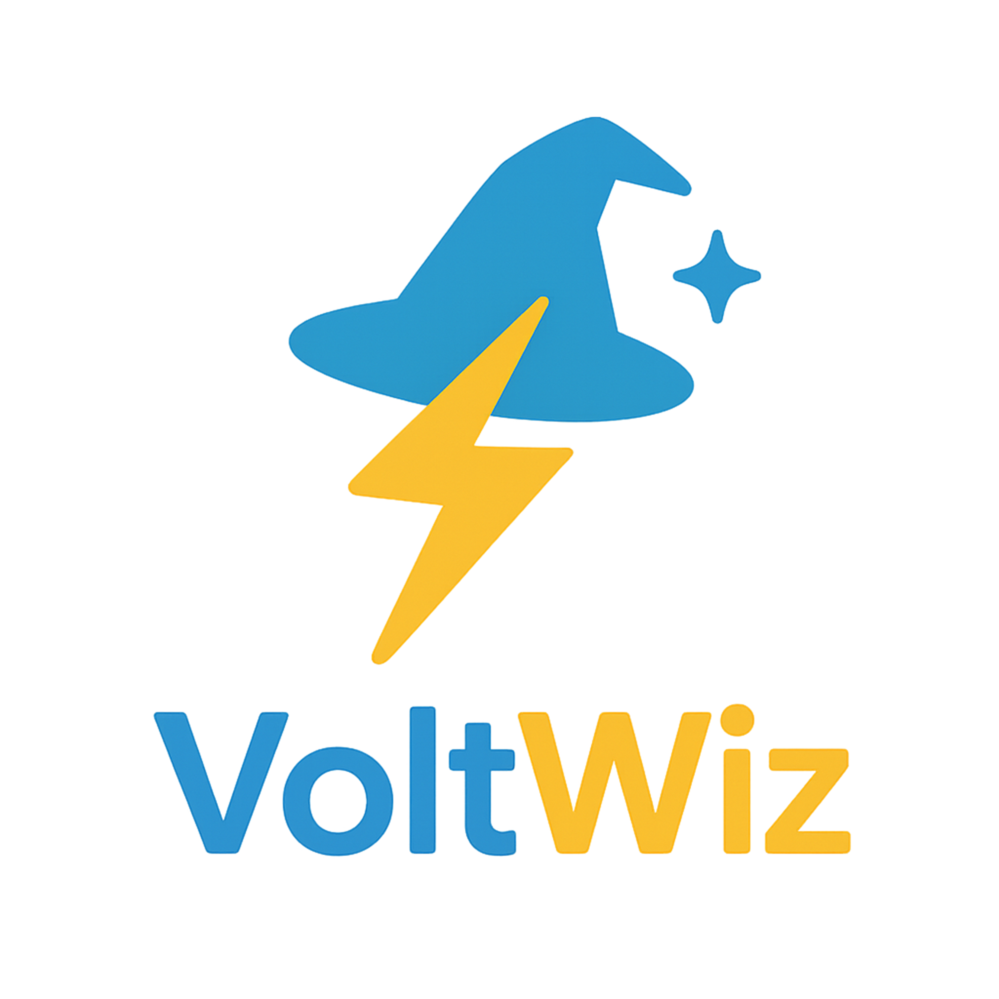

# VoltWiz - Electricity Provider Recommendation Bot



A Telegram bot that helps users find the best electricity provider based on their needs and usage patterns. The bot interact with users, collect their preferences, and provide personalized recommendations.

## Features

- Interactive conversation flow via WhatsApp
- Smart provider matching based on user requirements
- Preference-based recommendations (highest discount or time-specific discount)
- Detailed recommendation with plan details and next steps

## How It Works

1. **User Initiates Conversation**: The user sends a message to the WhatsApp number.
2. **Bot Asks Questions**: The bot asks a series of questions about the user's preferences:
   - Whether they have a smart meter
   - What's most important to them (highest discount or time-specific discount)
   - If time-specific, what hours they prefer
   - Minimum acceptable discount percentage
3. **Recommendation Calculation**: Based on the answers, the bot:
   - Filters out ineligible plans
   - Scores plans based on the user's priority (highest discount or time-specific)
   - Identifies the best plan
4. **Recommendation Delivery**: The bot sends a detailed recommendation including:
   - The recommended provider name
   - Plan details (discount percentage, hours, smart meter requirement)
   - Why this plan was chosen
   - Next steps for the user

## Installation
```bash
pip install uv
```

```bash
uv venv
```

```bash
# For Windows
.venv\Scripts\activate

# For macOSon Linux
source .venv/bin/activate
```

```bash
uv pip install -r requirements.txt
```

## Usage

### Running the Web Server

```bash
# Using the command-line interface
python run.py server --host 0.0.0.0 --port 5000 --debug

# Or using Python
python -m app
```

### Running the CLI Interface

```bash
# Using the command-line interface
python run.py cli

# Or using Python
python -m utils.cli
```


## License

This project is licensed under the MIT License - see the LICENSE file for details.

## Contributing

Contributions are welcome! Please feel free to submit a Pull Request.
